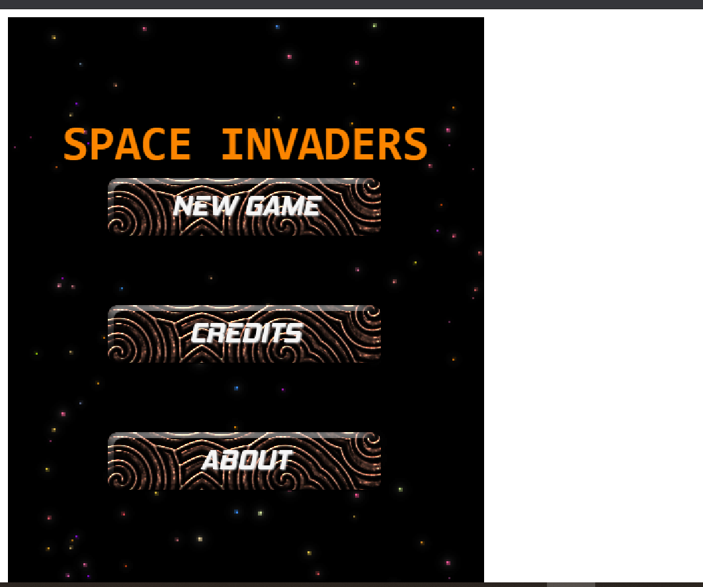

# SPACE INVADERS

This is a simple video shooting game implemented with phaser

## Built With

- JavaScript
- CSS
- Phaser
- Jest
- Webpack
- Babel

33 Screenshot

## Live Demo

[Live link](https://compassionate-newton-289538.netlify.app/)

## How to play
You are the pilot of a spaceship (maybe one among dozens), and your task is destroy all the enemies that you can for saving the Earth. In order to comply with this important duty, you can drive the spaceship and make it avoid the enemies'shots(lasers) using arrow keys (🡱🡳🡰🡲) and shoot the enemies spacebar.

Your enemies include a carrier ship,chasership and gunship.

When you click on New Game, the spaceship will start in the bottom of the screen, and the enemies will come from the top with differents velocities.

## Getting Started

- Clone the repo `https://github.com/ZawadiSumba66/shooter-game.git`
- cd into `shooter-game`
- Run `git pull origin game`
- On the terminal run:
  - `` npm install`` to get a copy of the packages in your local environment
  - ``npm run watch`` to run webpack that will intergrate all changes each and every time you make one
  - ``npm run start`` to start the server
- Open the app in your local host server while on the `todo-app` directory

## Authors

👤 **Rose Sumba**

- GitHub: [@ZawadiSumba66](https://github.com/ZawadiSumba66)
- Twitter: [@zawadirose1](https://twitter.com/zawadirose1)
- LinkedIn: [rose-sumba](https://www.linkedin.com/in/rose-sumba-9b36401b5/)

## 🤝 Contributing

Contributions, issues and feature requests are welcome!

Feel free to check the [issues page](issues/).

## Show your support

Give a ⭐️ if you like this project!

## 📝 License

Copyright 2021 Rose

Permission is hereby granted, free of charge, to any person obtaining a copy of this software and associated documentation files (the "Software"), to deal in the Software without restriction, including without limitation the rights to use, copy, modify, merge, publish, distribute, sublicense, and/or sell copies of the Software, and to permit persons to whom the Software is furnished to do so, subject to the following conditions:

The above copyright notice and this permission notice shall be included in all copies or substantial portions of the Software.

THE SOFTWARE IS PROVIDED "AS IS", WITHOUT WARRANTY OF ANY KIND, EXPRESS OR IMPLIED, INCLUDING BUT NOT LIMITED TO THE WARRANTIES OF MERCHANTABILITY, FITNESS FOR A PARTICULAR PURPOSE AND NONINFRINGEMENT. IN NO EVENT SHALL THE AUTHORS OR COPYRIGHT HOLDERS BE LIABLE FOR ANY CLAIM, DAMAGES OR OTHER LIABILITY, WHETHER IN AN ACTION OF CONTRACT, TORT OR OTHERWISE, ARISING FROM, OUT OF OR IN CONNECTION WITH THE SOFTWARE OR THE USE OR OTHER DEALINGS IN THE SOFTWARE.
