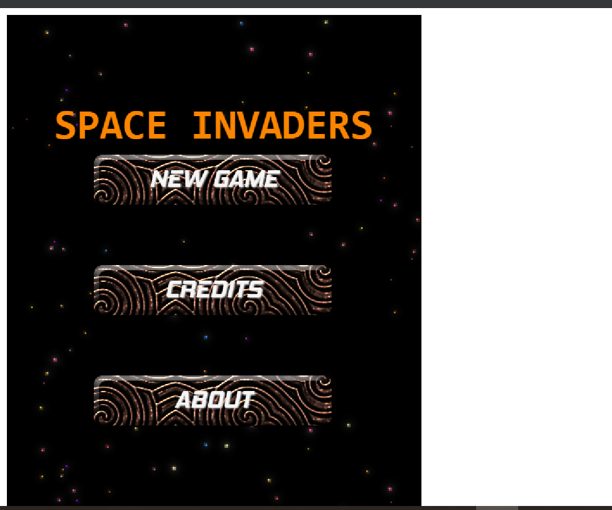

**🎮️ Name of the game: Space Invaders!\
👥 Stakeholders:**

- GitHub: [@ZawadiSumba66](https://github.com/ZawadiSumba66)
- Twitter: [@zawadirose1](https://twitter.com/zawadirose1)
- LinkedIn: [rose-sumba](https://www.linkedin.com/in/rose-sumba-9b36401b5/)

# Overview

## 📐 Project scope

- **Timeline: Needs to built within 5 working days from the request**
- **Budget: None**

## 🗣️ Elevator Pitch

This is a simple game. A player is expected to shoot other space ships to get more scores.

## 💵 Monetization

I create this game only to learn how to build a web application with JavaScript and Phaser 3. Monetization is not under concern for now.

# Story

In Space, there are a lot of space ships but not all of them are friends with each other. So there is one hero who should save his planet from enemies. To save his world he should shoot as many enemies as possible.

# Scenes

In the main main there are different buttons which will direct you to different scenes of the game

## New Game
- Where you start the game

## Credits
- Shows the top 5 scorers of the game

## About 
- Tells you a bit about the game and instructions on how to play

## Game Over
- Where one is taken when defeated by the enemy. Here, you can restart the game or fill the form to submit your score.

# Gameplay

In this game, you should shoot Carrier Ship, Gun Ship and Chaser Ship. But the scariest enemy is Chaser Ship because it chases you until you die. So you should be serious with Chaser ship. 

# Core Game Mechanic
## #1 Build platform game with Phaser3 Library

In this project, the developer implements Phaser 3 Library to build the platform game

## #2 Apply actions like moving and shooting to the main character

The main character is able to move and shoot enemies.

## #3 Scoring system using API

Collect username and set it with their scores to the API.
Display the top 5 scorers' name and their scores in the leaders board.

# Game elements

## 👤 Characters

- A Space ship
- Carrier Ship, Gun Ship and Chaser Ship (enemies)

## 🏆️ missions & scores

- The mission is to shoot as many enemies as possible without
- If the spaceship shoots an enemy, his score will increase by 10 points
- In the leaders board, the top 5 scorers are displayed

## 📦️ Objects

- Space Ships: Carrier Ship, Gun Ship and Chaser Ship
- Black background with falling stars to be the space 

# Assets

## 🎨 Art

- Background images: some of them are used OpenGameArt materials
